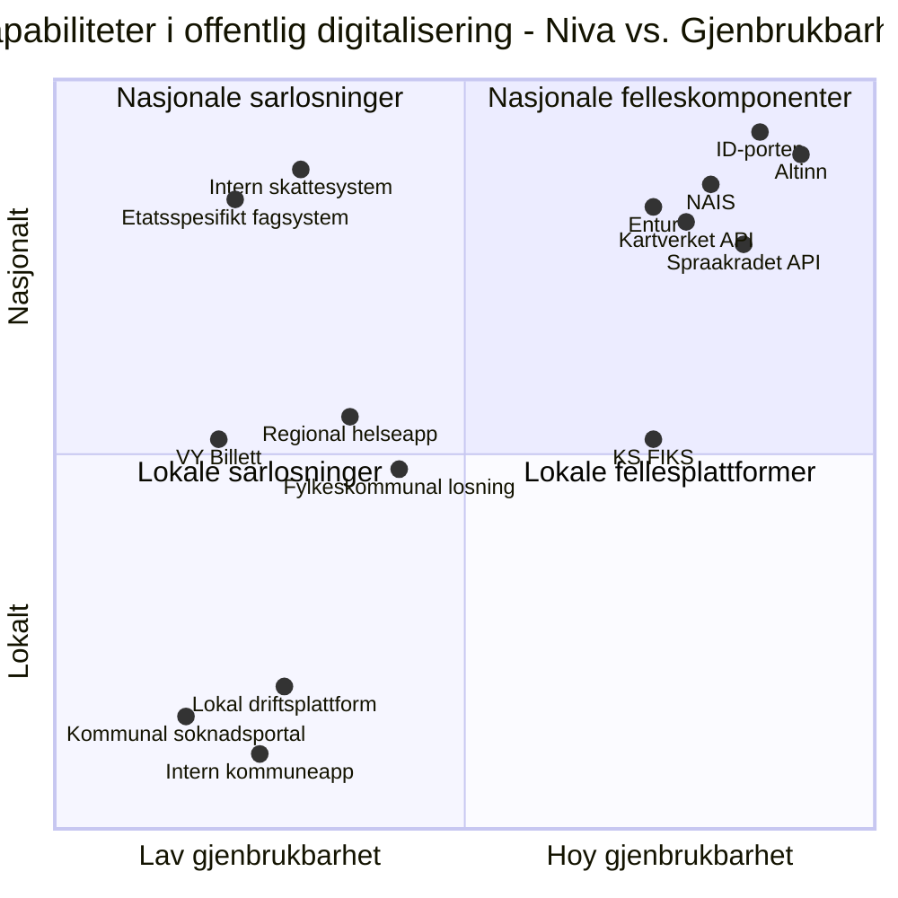

```mermaid
quadrantChart
    title Kapabiliteter i offentlig digitalisering - Niva vs. Gjenbrukbarhet
    x-axis Lav gjenbrukbarhet --> Hoy gjenbrukbarhet
    y-axis Lokalt --> Nasjonalt
    quadrant-1 Nasjonale felleskomponenter
    quadrant-2 Nasjonale sarlosninger
    quadrant-3 Lokale sarlosninger
    quadrant-4 Lokale fellesplattformer
    NAIS: [0.80, 0.86]
    Altinn: [0.91, 0.90]
    ID-porten: [0.86, 0.93]
    Kartverket API: [0.77, 0.81]
    Spraakradet API: [0.84, 0.78]
    Entur: [0.73, 0.83]
    Etatsspesifikt fagsystem: [0.22, 0.84]
    Intern skattesystem: [0.30, 0.88]
    KS FIKS: [0.73, 0.52]
    VY Billett: [0.20, 0.52]
    Regional helseapp: [0.36, 0.55]
    Fylkeskommunal losning: [0.42, 0.48]
    Lokal driftsplattform: [0.28, 0.19]
    Kommunal soknadsportal: [0.16, 0.15]
    Intern kommuneapp: [0.25, 0.10]
```